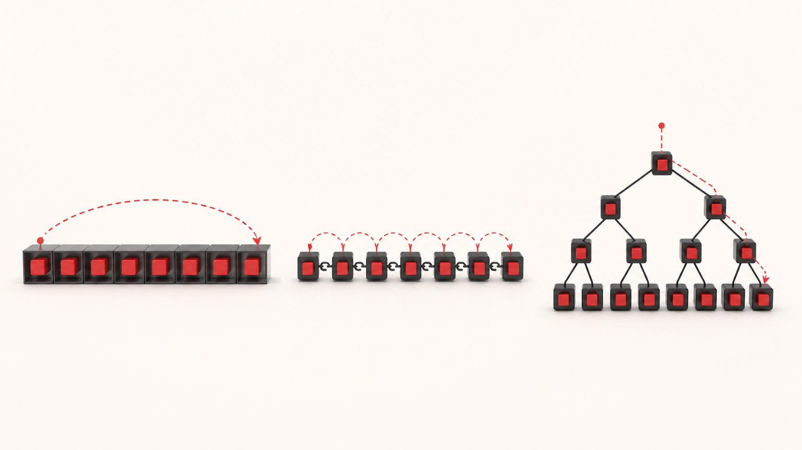
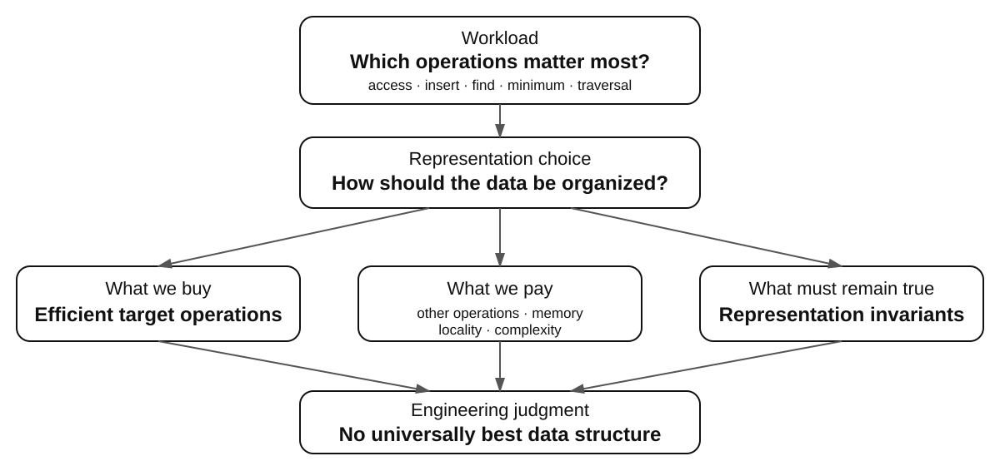
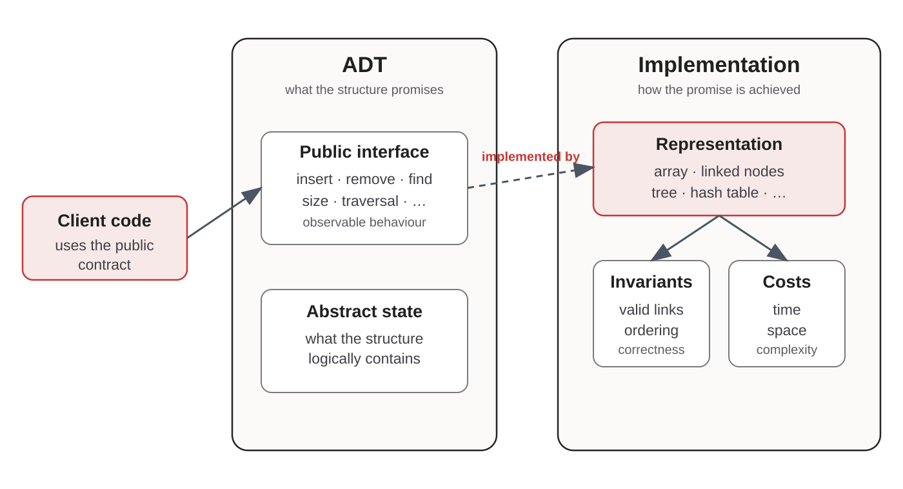
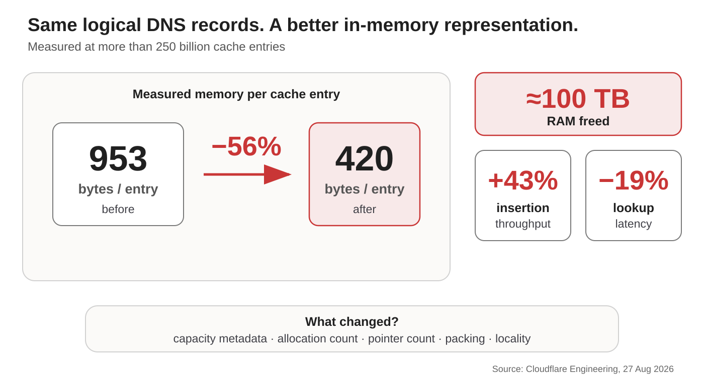
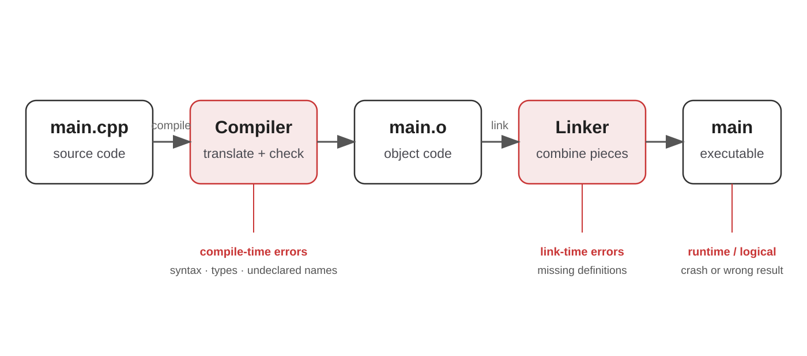
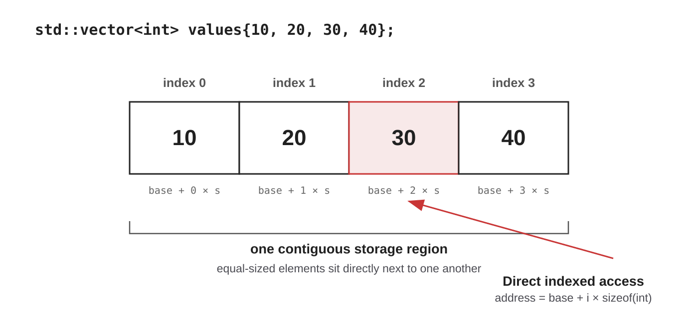
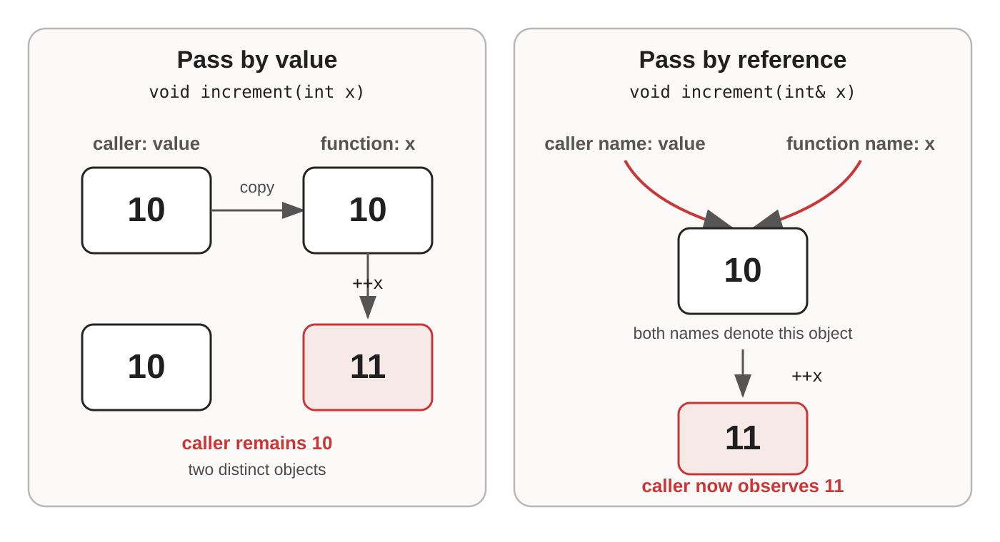
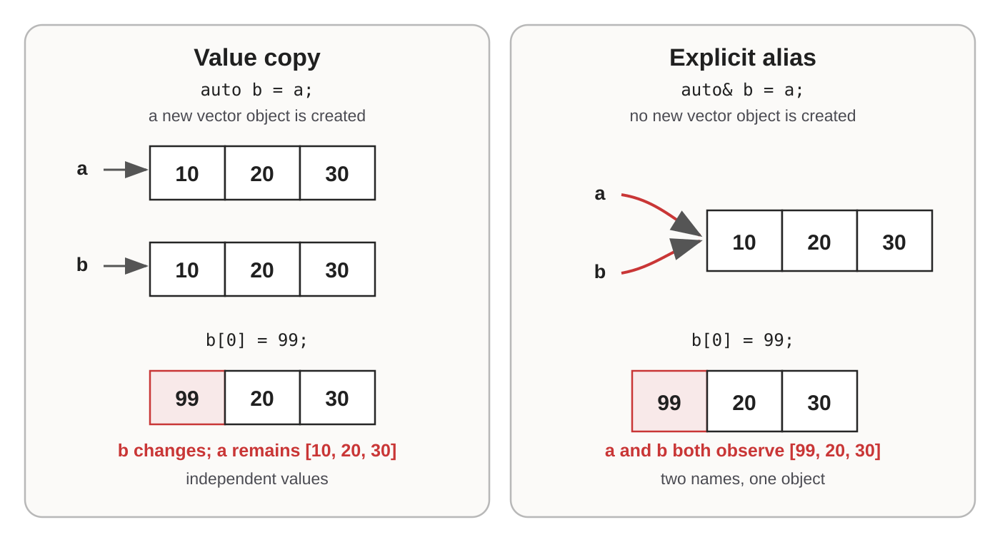
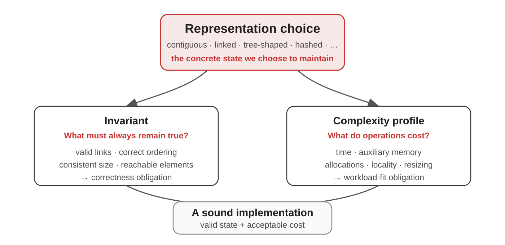
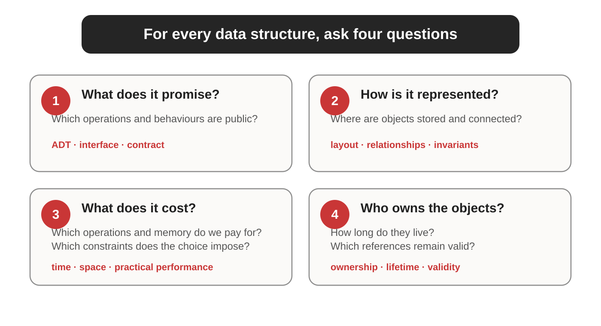

<!--
_class: title
_paginate: skip
_backgroundImage: "url('./assets/bs0013-title-slide-base.png')"
_backgroundSize: cover
-->

# From General Programming to C++ Data Structures

**Week 1 · BS0013 Data Structures**

Riga Business School · Riga Technical University

---

<!-- _class: hook -->



# Same data. Different structure. Different cost.

<!--
[Sources]
- Course asset: `./assets/w01-10-opening-representation.png`.
-->

---

<!--
backgroundImage: "url('./assets/bs0013-content-slide-background-footer-only.png')"
backgroundSize: cover
-->

# Today’s target is an engineering mental model

By the end, you should be able to:

- separate an **ADT contract** from its implementation;
- explain why the **workload** influences representation choice;
- trace C++ **values, copies, references, and mutation**;
- connect representation to **invariants and operation costs**.

---

# One million values is not yet a design

What must the program do most often?

- access element number 742,381;
- append new elements;
- insert at the beginning;
- test whether a value exists;
- retrieve the smallest value;
- maintain sorted order.

**Different workloads reward different representations.**

---

<!-- _class: question -->

# How can the same data produce radically different costs?

| Representation idea | Access element 742,381 |
|---|---|
| Directly indexed storage | Calculate its location |
| Chain of linked elements | Follow links until reaching it |

The logical values may be identical. The **path to the value** is not.

---

<!-- _class: visual -->

# Data-structure choice is a trade-off



---

<!-- _class: question -->

# Start with the operation, not the structure name

What matters most in each situation?

1. A music player asks for the **next** song.
2. Triage repeatedly asks for the **most urgent** patient.
3. A spell-checker asks whether a **word exists**.
4. Navigation asks which roads leave an **intersection**.
5. An editor inserts and removes material from a **sequence**.

---

<!-- _class: visual -->

# An ADT specifies the promise; a data structure realizes it



<!--
[Sources]
- C++ Core Guidelines, “Interfaces”: https://isocpp.github.io/CppCoreGuidelines/CppCoreGuidelines#S-interfaces
-->

---

# One interface can hide several representations

A **stack** promises operations such as:

```text
push(value)   pop()   top()   empty()
```

It could be represented by:

- a fixed array;
- a dynamic array;
- linked nodes.

Client code may stay unchanged while performance and memory behaviour change.

---

<!-- _class: visual visual-tight -->

# Representation choices matter at production scale



<!--
[Sources]
- Cloudflare Engineering, “How we saved 100 terabytes of memory by optimizing 1.1.1.1's DNS cache,” 27 August 2026: https://blog.cloudflare.com/dns-cache-memory-optimization-1111/
-->

---

# Pay only for flexibility the workload needs

| Growable storage | Fixed-size storage after construction |
|---|---|
| pointer + length + capacity | pointer + length |
| may reserve unused space | no spare growth capacity |
| supports future growth | smaller immutable representation |

Cloudflare’s cached DNS responses did not need to grow after insertion.

**A growable vector is not bad. It is unnecessary overhead when growth is not required.**

<!--
[Sources]
- Cloudflare Engineering, “How we saved 100 terabytes of memory by optimizing 1.1.1.1's DNS cache,” 27 August 2026: https://blog.cloudflare.com/dns-cache-memory-optimization-1111/
-->

---

<!--
_class: section-divider
_backgroundImage: "url('./assets/bs0013-content-slide-background-themed.png')"
_backgroundSize: cover
-->

# C++ makes representation visible

High-level abstraction without hiding every implementation cost

---

# C++ began with a systems-design tension

Stroustrup’s problem was practical:

> How can programmers build stronger abstractions without giving up C-like efficiency and systems control?

```text
1979 C with Classes → 1983 C++ → 1998 ISO standard
                     → 2011 modern C++ → C++20 in this course
```

Simula contributed abstraction ideas; C contributed efficiency and low-level control.

<!--
[Sources]
- Bjarne Stroustrup, “A History of C++: 1979–1991”: https://www.stroustrup.com/hopl2.pdf
- Bjarne Stroustrup, FAQ: https://www.stroustrup.com/bs_faq.html
-->

---

# C++ lets us inspect both levels

We can treat `std::vector` as a container and still ask:

- Are its elements contiguous?
- When is storage reallocated?
- When are values copied or moved?
- Which references remain valid?
- What does an operation cost?

**Pedagogical implementation:** expose mechanics.  
**Production engineering:** normally prefer tested standard containers.

---

<!-- _class: visual visual-tight -->

# A C++ program passes through distinct build stages



<!--
[Sources]
- GCC documentation, “Invoking GCC”: https://gcc.gnu.org/onlinedocs/gcc/Invoking-GCC.html
-->

---

<!-- _class: question compact -->

# Predict when each problem is discovered

```cpp
int number = "Riga";
```

```cpp
std::cout << total;  // total was never declared
```

```cpp
int divide(int a, int b) { return a / b; }
// later: divide(10, 0)
```

Compile time, link time, runtime, or logical error?

---

# Static types are representation promises

```cpp
std::vector<int> values;
```

This declaration promises:

> Every element stored in this vector is an `int`.

Compare:

```python
values = [42, "Riga", 3.14, True]
```

Neither model is universally better. They support different forms of reasoning and flexibility.

<!--
[Sources]
- C++ working draft, sequence containers: https://eel.is/c++draft/sequences.general
-->

---

# `std::vector` is our first concrete container

```python
# Python
values = [10, 20, 30]
values.append(40)
```

```cpp
// C++
std::vector<int> values{10, 20, 30};
values.push_back(40);
```

Similar intent does not imply identical representation or semantics.

<!--
[Sources]
- cppreference, `std::vector`: https://en.cppreference.com/w/cpp/container/vector.html
-->

---

<!-- _class: visual -->

# Contiguous storage explains direct indexed access



<!--
[Sources]
- C++ working draft, sequence containers: https://eel.is/c++draft/sequences.general
- cppreference, `std::vector`: https://en.cppreference.com/w/cpp/container/vector.html
-->

---

<!-- _class: question -->

# Which vector operation should make us suspicious?

- read element 500;
- change element 500;
- add an element at the end;
- insert an element at index 0.

If elements occupy one contiguous region, inserting at the front may require moving every existing element.

**Representation is already predicting cost.**

---

<!--
_class: section-divider
_backgroundImage: "url('./assets/bs0013-content-slide-background-themed.png')"
_backgroundSize: cover
-->

# Objects, copies, and aliases

Trace object identity—not punctuation

---

<!-- _class: question -->

# Prediction: does the caller’s value change?

```cpp
void increment(int x) {
    ++x;
}

int value = 10;
increment(value);
std::cout << value;
```

Commit to an answer before running the program.

---

<!-- _class: visual -->

# A value parameter copies; a reference parameter aliases



<!--
[Sources]
- C++ working draft, references: https://eel.is/c++draft/dcl.ref
-->

---

<!-- _class: question compact -->

# Mini-trace: follow objects and aliases

```cpp
void add_one(int x)  { ++x; }
void add_two(int& x) { x += 2; }

int value = 10;
add_one(value);
add_two(value);
std::cout << value;
```

What is printed—and why?

---

# Function signatures are contracts

| Parameter form | Full object copy? | May modify caller’s object? |
|---|---:|---:|
| `T value` | yes | no |
| `T& value` | no | yes |
| `const T& value` | no | no |

```cpp
int maximum(const std::vector<int>& values);
```

The function can inspect a large vector without copying it or mutating it through this reference.

<!--
[Sources]
- C++ Core Guidelines, “Constants and immutability”: https://isocpp.github.io/CppCoreGuidelines/CppCoreGuidelines#S-const
- C++ Core Guidelines, “Functions”: https://isocpp.github.io/CppCoreGuidelines/CppCoreGuidelines#S-functions
-->

---

<!-- _class: question -->

# Prediction: what does `a` contain?

```cpp
std::vector<int> a{10, 20, 30};

auto b = a;
b[0] = 99;
```

Is `a[0]` now `10` or `99`?

---

<!-- _class: visual -->

# Copying creates a value; `&` requests an alias



<!--
[Sources]
- C++ working draft, memory and objects: https://eel.is/c++draft/intro.object
- C++ working draft, references: https://eel.is/c++draft/dcl.ref
-->

---

<!-- _class: question compact -->

# Integrated trace: copy, alias, then mutate

```cpp
std::vector<int> a{1, 2, 3};

auto b = a;
auto& c = a;

b[0] = 10;
c[1] = 20;
a.push_back(4);
```

Determine the final contents of `a`, `b`, and `c`.

---

<!-- _class: answer -->

# The object model predicts the result

| Name | Final contents | Why |
|---|---|---|
| `a` | `[1, 20, 3, 4]` | original vector object |
| `b` | `[10, 2, 3]` | independent copy |
| `c` | `[1, 20, 3, 4]` | reference: another name for `a` |

The important result is not the numbers. It is the **object model** that makes them predictable.

<!--
[Sources]
- C++ working draft, memory and objects: https://eel.is/c++draft/intro.object
-->

---

<!--
_class: section-divider
_backgroundImage: "url('./assets/bs0013-content-slide-background-themed.png')"
_backgroundSize: cover
-->

# From records to data structures

Representation + relationships + invariants

---

<!-- _class: compact -->

# A `struct` groups values into one logical record

```cpp
struct Measurement {
    std::string name;
    double value;
};

Measurement cpu{"CPU temperature", 61.5};
```

A future node begins the same way:

```cpp
struct Node {
    int value;
    // relationships to other nodes come next
};
```

**Complex structures are simpler records plus relationships.**

---

<!-- _class: compact -->

# A class separates interface from representation

```cpp
class IntSequence {
public:
    void append(int value);
    std::size_t size() const;
    int at(std::size_t index) const;

private:
    std::vector<int> data_;
};
```

Client code sees `append`, `size`, and `at`.  
The current representation is `std::vector<int>`.

---

# The same interface can hide different costs

Suppose `IntSequence` preserves these methods:

```text
append(value)   size()   at(index)
```

| Internal representation | `at(index)` |
|---|---|
| Contiguous vector | direct indexed access |
| Linked sequence | traverse from a known end |

Existing client code may still compile. Its performance assumptions may no longer hold.

---

<!-- _class: question -->

# Duplicated state creates a new invariant

```cpp
class IntSequence {
private:
    std::vector<int> data_;
    std::size_t size_;
};
```

Now every mutating operation must preserve:

```text
size_ == data_.size()
```

If `data_.size()` is already available, what justifies storing `size_` again?

---

<!-- _class: visual -->

# Representation creates both correctness and cost obligations



---

# Complexity is essential—but not sufficient

For a vector-backed sequence:

| Operation | Initial complexity claim |
|---|---:|
| `at(index)` | `Θ(1)` |
| `append(value)` | amortized `Θ(1)` |
| insert at front | `Θ(n)` |

Also inspect:

**locality · allocations · pointer chasing · resizing · memory overhead · constants**

<!--
[Sources]
- cppreference, `std::vector` complexity: https://en.cppreference.com/w/cpp/container/vector.html
-->

---

<!-- _class: visual -->

# Carry four questions into every new structure



---

# AI can generate code; it cannot remove the design obligation

When an AI proposes a container or implementation, someone must still ask:

- Does the representation match the workload?
- What invariants must remain true?
- What are the time and space costs?
- Are copying, ownership, and lifetime correct?
- Do the tests demonstrate the required behaviour?

> If you cannot explain why a solution works, you cannot reliably recognize when it does not.

---

# Practical work: predict, run, explain

In the Week 1 practical session you will:

- compile and run C++20 code;
- interpret compiler diagnostics;
- use `std::vector` and small records;
- diagnose value versus reference behaviour;
- trace copies and aliases before execution;
- explain what representation a small class uses.

The objective is not syntax memorization. It is a mental model accurate enough to implement data structures.

---

<!-- _class: big-claim -->

# Week 2 begins where aliases are no longer enough

**Node 10** → **Node 20** → **Node 30**

How can one node store the location of another—and who owns those nodes?

**Next:** pointers, lifetime, ownership, RAII, and templates.

---

<!-- _class: compact -->

# Authoritative references and further reading

- Bjarne Stroustrup — [A History of C++: 1979–1991](https://www.stroustrup.com/hopl2.pdf)
- Bjarne Stroustrup — [A Tour of C++, 3rd edition](https://www.stroustrup.com/tour3.html)
- Stroustrup and Sutter — [C++ Core Guidelines](https://isocpp.github.io/CppCoreGuidelines/CppCoreGuidelines)
- [C++ working draft: Memory and objects](https://eel.is/c++draft/intro.object)
- [C++ working draft: Sequence containers](https://eel.is/c++draft/sequences.general)
- [cppreference](https://en.cppreference.com/)

Use references to resolve precise language and library questions—not as a substitute for tracing the program’s objects and operations.

<!--
[Sources]
- Links shown on the slide are the authoritative references for this student deck.
-->
